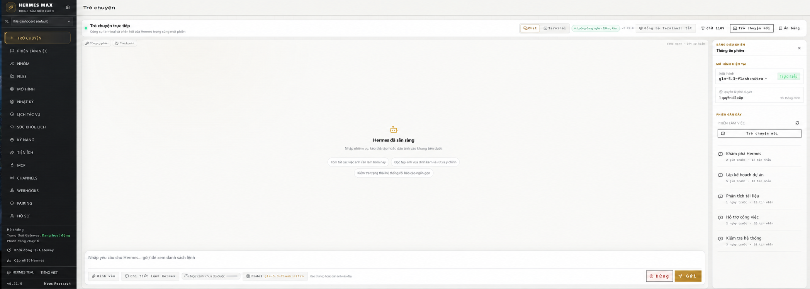
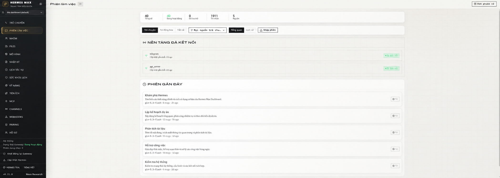

# Hermes Max · Command Center

A dashboard overlay for [Hermes Agent](https://github.com/NousResearch/hermes-agent)
that adds the panels the stock web dashboard does not have: writable group
chats, a sub-agent monitor, a context gauge, permission management, session
tools, file checkpoints, and the animated pet.

**Not affiliated with Nous Research.** This is a community package that
modifies a Hermes Agent installation on your own machine.

---
## Screenshots

### Giao diện trò chuyện



### Quản lý phiên làm việc



---

## Read this first

**The added UI is in Vietnamese.** This package was built Vietnamese-first, and
every panel it adds — group chats, session tools, checkpoints, the pet, the
permission table — is written in Vietnamese. Hermes's own interface stays in
whatever language you have set. If you do not read Vietnamese, roughly half of
what this package adds will not be usable to you yet. Translations are welcome;
see [Contributing](#contributing).

**It modifies your Hermes installation.** It copies files over the web
workspace, edits six core files a few lines at a time, and rebuilds the
dashboard. Everything it touches is backed up first and one command puts it all
back — but you should know that going in.

**Requirements:** Hermes Agent v0.21.0 or newer, Windows, PowerShell 5.1+, and a
completed `hermes update` (the repo needs its `node_modules`).

---

## Install

Download the release zip, extract it, then in PowerShell:

```powershell
Set-ExecutionPolicy -Scope Process Bypass -Force
& '<extracted-folder>\Install-HermesTealMax.ps1'
```

The installer finds your Hermes installation by itself — any drive, any folder
name. If it cannot, point it at yours:

```powershell
& '<extracted-folder>\Install-HermesTealMax.ps1' -HermesRoot 'D:\HERMES AGENT'
```

`-HermesRoot` is the folder that **contains** `hermes-agent`. Passing the repo
folder itself works too.

The install takes a few minutes: it copies files, patches the core, runs
`npm run build`, runs the test suite, verifies the version stamp actually
reached the built output, and restarts the dashboard background task. **If any
step fails it restores everything it touched and then reports the error**, so a
broken build never reaches your machine.

Then open <http://127.0.0.1:9119/>.

### Options

| Flag | What it does |
|---|---|
| `-HermesRoot <path>` | Skip auto-detection and use this installation. |
| `-Language auto\|vi\|en` | `auto` (default) switches the dashboard to Vietnamese **only if Windows is set to Vietnamese**. `vi` always switches, `en` never touches the setting. |
| `-FullTests` | Run Hermes's entire web test suite (874 tests) instead of only this package's (589). |
| `-SkipTests` | Skip the post-build tests. |
| `-SkipBackgroundTask` | Do not (re)install the scheduled task that keeps the dashboard running. |

---

## Uninstall — back to the stock dashboard

```powershell
Set-ExecutionPolicy -Scope Process Bypass -Force
& '<extracted-folder>\Restore-HermesDashboard.ps1'
```

That restores the most recent backup: every overlay file, the six patched core
files, and the built `web_dist`. It finds your Hermes installation the same way
the installer does, and accepts the same `-HermesRoot`.

Backups live in `<HermesRoot>\backups\hermes-teal-max-<timestamp>\`, one per
install, each with a `manifest.json` recording exactly which files existed
beforehand — so restoring removes files that were not there originally instead
of leaving them behind. To go back to a specific one:

```powershell
& '<extracted-folder>\Restore-HermesDashboard.ps1' -BackupPath 'D:\HERMES AGENT\backups\hermes-teal-max-20260902-114500'
```

The restore snapshots the current state first, into
`backups\dashboard-before-restore-<timestamp>\`, so **the restore is itself
reversible**.

---

## What it adds

**Group chats (Nhóm)** — Hermes's hosted rooms, made writable. Create a room
from 2–6 local profiles, send a message, and watch the members discuss it and
call each other by `@handle`. Three columns, collapsible room list, and a
members panel where each member's model can be changed.

**Sub-agent monitor** — when Hermes delegates work, this shows each child agent,
what it is doing, how long it has run, its token counts, and its own transcript.
Sub-agents can be interrupted individually, and new delegation can be paused.

**Context gauge** — how much of the model's context window the session is using,
with a breakdown by category, read from `session.usage` rather than estimated.

**Permissions** — the 113 permission types Hermes recognises, in a table, with
revoke that actually takes effect on the running process (see
[Upstream bugs](#upstream-bugs-found)).

**Session tools** — ask a side question without disturbing the running turn,
steer or redirect a turn mid-flight, compress the conversation, undo the last
exchange, or fork the session into a branch.

**Checkpoints** — the file snapshots Hermes takes before it writes. List them,
diff them, and restore either a single file or the whole tree.
*Off by default in the dashboard's gateway* — see the panel, which explains how
to enable it.

**Pet** — Hermes's animated mascot in the corner of the chat, posing according
to what the agent is doing.

**Cron health, Vietnamese localisation of 368 Hermes messages, an approval card,
a clarify form, favourite-model quick switching**, and an Ivory Graphite theme.

### What it deliberately does not add

Several panels stop short of what a mockup would suggest, because the runtime
has no data behind it. Room members get generated initials rather than invented
avatars, and no per-member "online" light, because `driver_status` reports
liveness for the room and not per member. The pet has no hunger, level, XP or
mood, because Hermes stores none. Meeting bounds are shown without an edit
button because they are compiled constants. Each of these is documented at the
point it was decided, in the source.

---

## Upstream bugs found

Building this surfaced defects in Hermes Agent itself. Two ship with
reproductions that fail on stock Hermes and pass once patched:

- **`tools/approval.py` — revoking a permission did not take effect.**
  `load_permanent` unioned the reloaded set into the live one instead of
  replacing it, so a permission removed from `config.yaml` stayed active in the
  running process, and the next "always allow" wrote the stale set back to disk.
  Reproduction: `Test-HermesPermissions.py`.

- **`hermes_cli/web_server.py` — the dashboard could lose the main
  conversation.** `_session_latest_descendant` walks every child session with no
  filter. A delegated sub-agent's session is also a child, and right after a
  delegation batch it is the *newest* child — so the dashboard followed the
  chain into a sub-agent's private transcript and the real conversation vanished
  from the chat. A user-created branch has the same problem for the same reason.
  Reproduction: `Test-HermesSessionTree.py`.

Two more are worked around but not yet reported: `rollback.list` reads a
`message` key the checkpoint manager never emits (so every checkpoint label is
empty), and `rollback.diff` discards the manager's error flag, making a failed
lookup indistinguishable from a clean tree.

---

## How it is built

`overlay/` is copied over the Hermes web workspace. Six Hermes files are **not**
copied — they are edited in place by `Patch-HermesCore.py`, because shipping
whole copies downgrades them whenever the installed Hermes is newer than this
package. That is not hypothetical: it happened twice, once demoting a dangerous
command detector, and once breaking the build of all sixteen other languages
when upstream added a translation key. Every patch step refuses rather than
guesses when it cannot recognise the code it is editing, and re-running the
installer is a no-op.

Every release is verified against a **clean checkout of upstream `main`**:
apply, patch, build, run the full test suite, run the three Python self-tests,
and confirm the version stamp reached the built JavaScript. Lint must stay at
upstream's own warning count — this package adds none.

## Contributing

The most useful contribution is **translating the added panels**. The strings
are inline in the components rather than in a locale file, which was the wrong
call for a package meant to be shared; extracting them is the first step and a
good first issue.

Bug reports about Hermes itself are better filed
[upstream](https://github.com/NousResearch/hermes-agent/issues).

## License

MIT. See [LICENSE](LICENSE) and [NOTICE](NOTICE) — the latter lists which files
are modified copies of Hermes Agent, which is MIT and Copyright (c) 2025 Nous
Research.

The Vietnamese changelog, which documents every version and the reasoning behind
each decision, is in [CHANGELOG-vi.md](CHANGELOG-vi.md).
